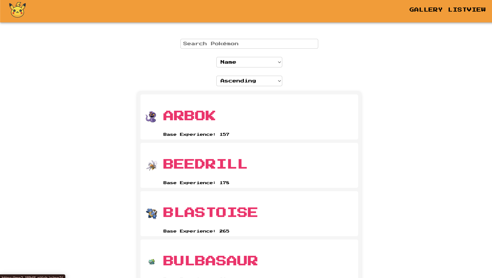
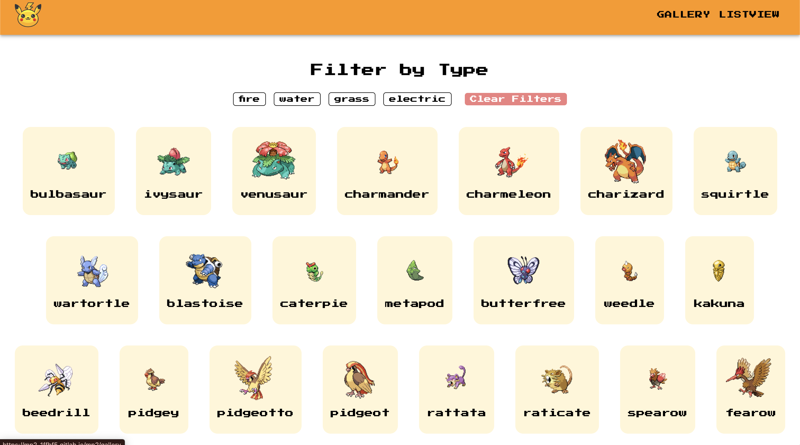

# Pokedex

This project is a simple implementation of <a href="https://pokeapi.co/" target="_blank">Pokemon API</a>

## Table of Contents

- [About](#about)
- [Installing](#installing)
- [Usage](#usage)
- [Screenshots](#screenshots)
- [Contributors](#contributors)
- [Contributing](#contributing)

## About

The application has the following features -

- You can access the Pokemon Database
- You can search for your favourite pokemon
- You can sort the Pokemon in asc and desc order in listview
- You can filter the pokemon according to their types in gallery view
- You can see the individual details of the pokemon on the detail view page

## Installing

First clone the repository on your local machine, by running the following command in your desired directory:

```sh
git clone https://github.com/Venkateshkamat/Pokedex.git
```

```sh
cd Pokedex
```

```sh
npm i
```

## Usage

```sh
npm start
```

## Screenshots





## Contributors

Pull requests are always welcome! Please base pull requests against the `master`

## Contributing

<a href="https://github.com/Venkateshkamat"><br /><b>Venkatesh Kamat</b></a>
